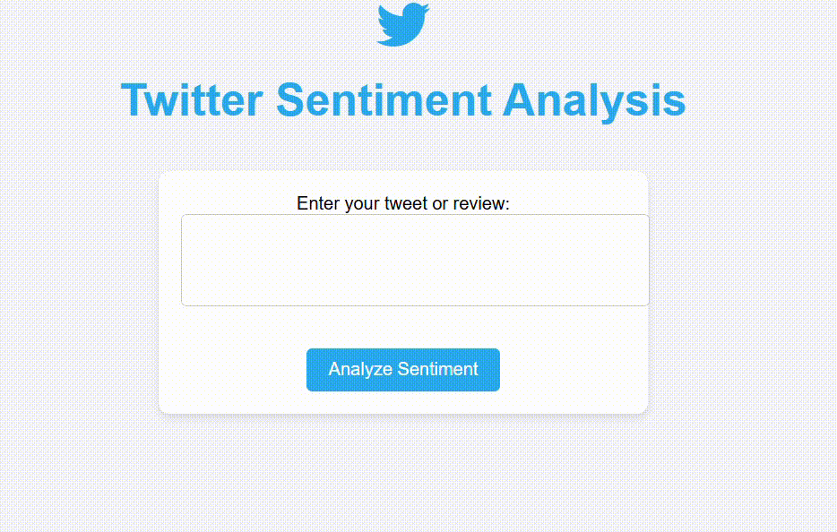

# Twitter Sentiment Analysis Project

## Overview

This project focuses on building a Twitter Sentiment Analysis system that predicts sentiment (positive, neutral, negative) from tweets or product reviews. It leverages data preprocessing, training deep learning models via Docker on Google Cloud Platform (GCP).

The trained model is then deployed in the Twitter Sentiment Analysis App shown below for real-time sentiment analysis.



---

## Data Understanding

The dataset used for this project is stored in `root/data/processed/`. It includes:

- **Tweets or Product Reviews**: Text data for analysis.

- **Sentiments**: Labels indicating sentiment (e.g., positive, neutral, or negative).

### Preprocessing Steps:

1. **Tokenization**: Splitting text into words/tokens.

2. **Embedding**: Using pre-trained word embeddings like GloVe for vector representation of words.

3. **Padding**: Ensuring uniform input length for the model.

4. **Label Encoding**: Converting sentiments into numerical format for training.

---

## Training the Model

The model training process is handled in the Jupyter notebook `root/notebooks/model-training.ipynb`.

### Key Steps:

1. **Data Loading**: Read preprocessed data from `root/data/processed/`.

2. **Model Architecture**:
   
   - Embedding Layer (pre-trained weights, frozen).
   
   - LSTM Layer for sequence processing.
   
   - Dense Layer for sentiment classification.

3. **Compilation**:
   
   - Loss: `binary_crossentropy` or `categorical_crossentropy`.
   
   - Optimizer: Adam.
   
   - Metrics: Accuracy.

4. **Training**:
   
   - Batch Size: 32.
   
   - Epochs: 10 (adjust based on hardware).
   
   - Validation Split: 20%.

---

## Deployment

### Flask Application

The app provides the following functionalities:

- **Input**: A tweet or product review.

- **Output**: Predicted sentiment with probability.

#### App Code

Stored in `root/app/` and includes:

- `app.py`: Core Flask/Streamlit application.

- `templates/`: HTML templates for the interface (if using Flask).

- `requirements.txt`: Python dependencies.

---

## Containerization

### Dockerfile

The `Dockerfile` specifies the environment for the application:

```dockerfile
# Use the base image with Jupyter and TensorFlow for GPU support
FROM tensorflow/tensorflow:latest-gpu-jupyter

# Set the working directory
WORKDIR /app

# Copy the entire project into the container
COPY . /app

# Create a virtual environment
RUN python -m venv /venv

# Activate the virtual environment
ENV PATH="/venv/bin:$PATH"

# Install Python dependencies
RUN pip install --no-cache-dir -r requirements.txt

# Expose the Jupyter Notebook port
EXPOSE 8888

# Command to run Jupyter Notebook
CMD ["jupyter", "notebook", "--ip=0.0.0.0", "--port=8888", "--no-browser", "--allow-root"]
```

---

### Building the Docker Image

1. Build the Docker image:
   
   ```bash
   docker build -t twitter-sentiment-analysis .
   ```

2. Run the container locally:
   
   ```bash
   docker run -p 5000:5000 twitter-sentiment-analysis
   ```

---

### Pushing to Docker Hub

1. Log in to Docker Hub:
   
   ```bash
   docker login
   ```

2. Tag the image:
   
   ```bash
   docker tag twitter-sentiment-analysis dockerhub_username/twitter-sentiment-analysis
   ```

3. Push the image:
   
   ```bash
   docker push dockerhub_username/twitter-sentiment-analysis
   ```

---

### Pulling and Running the Image

#### On a Different PC or Server:

1. Pull the image from Docker Hub:
   
   ```bash
   docker pull dockerhub_username/twitter-sentiment-analysis
   ```

2. Run the container:
   
   ```bash
   docker run -p 5000:5000 dockerhub_username/twitter-sentiment-analysis
   ```

---

### Running on Google Cloud Platform (GCP)

1. **Set Up VM Instance**:
   
   - Create a VM instance with Docker pre-installed.
   
   - Configure a firewall rule to allow traffic on port 5000.

2. **Deploy the Container**:
   
   - SSH into the instance.
   
   - Pull the Docker image:
     
     ```bash
     docker pull dockerhub_username/twitter-sentiment-analysis
     ```
   
   - Run the container:
     
     ```bash
     docker run -it dockerhub_username/twitter-sentiment-analysis
     ```

3. **Access the Application**:
   
   - Navigate to `http://<VM_INSTANCE_EXTERNAL_IP>:5000` in your browser.

---

## Stopping the Docker Container

To stop a running container:

1. List running containers:
   
   ```bash
   docker ps
   ```

2. Stop the container:
   
   ```bash
   docker stop <CONTAINER_ID>
   ```

## Notes

- Ensure the processed data is updated and compatible with the notebook and app.

- Use GPU-enabled hardware for faster training if possible.

- Update dependencies in `requirements.txt` as needed.

## Twitter Sentiment Analysis App

This app is a Twitter Sentiment Analysis application that predicts the sentiment (positive, neutral, or negative) of tweets or product reviews. The application was developed using a Flask web framework and integrates a PyTorch model for real-time sentiment analysis.

### 1. App Interface

The app provides an interface where users can input a tweet or review. The input is then processed by the model to predict its sentiment. The result is displayed on the same page immediately after submission.

### 2. Model Inference

The trained sentiment analysis model is deployed in the Flask application, making it accessible via the web interface. Users can submit a tweet or review, and the model processes the input text to display the predicted sentiment along with the associated probability.